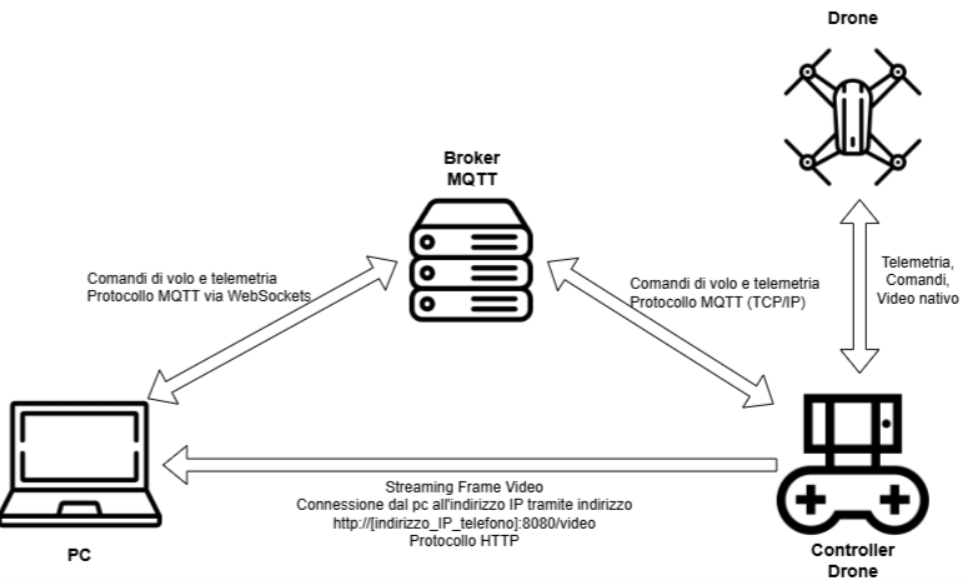
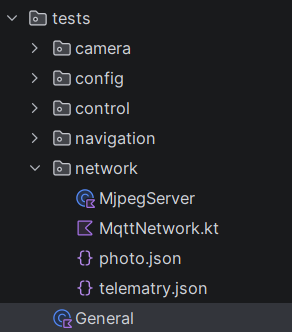

# Platform per Analisi Spaziale e Telemetria Drone

Un'applicazione web full-stack per la gestione, l'analisi territoriale e la visualizzazione cartografica di dati telemetrici e rilievi fotografici raccolti da droni. Il sistema integra un database geospaziale **PostgreSQL + PostGIS**, un backend **Express (Node.js)** e un frontend interattivo basato su **Leaflet.js** con clustering dinamico via **Geohash**.

---

## Indice
1. [Descrizione del Progetto](#-descrizione-del-progetto)
2. [Struttura del Progetto](#-struttura-del-progetto)
3. [Tecnologie Utilizzate](#-tecnologie-utilizzate)
4. [Analisi Dettagliata dei Moduli](#-analisi-dettagliata-dei-moduli)
   - [Backend (`src/`)](#backend-src)
   - [Frontend (`public/`)](#frontend-public)
5. [Configurazione del Database (PostgreSQL / PostGIS)](#-configurazione-del-database-postgressql--postgis)
6. [Guida all'Installazione e Avvio](#-guida-allinstallazione-e-avvio)
7. [Integrazione API REST](#-integrazione-api-rest)

---

## Descrizione del Progetto

Il progetto ha l'obiettivo di centralizzare e analizzare i rilievi territoriali effettuati da droni (misurazioni di temperatura, foto georeferenziate, posizioni GPS e perimetri di aree monitorate come serre o zone agricole).

### Funzionalità Principali:
- **Visualizzazione Cartografica**: Mappa satellitare interattiva ad alta risoluzione con overlay personalizzati (es. ortofoto/mappe di serre).
- **Ingegneria Spaziale PostGIS**: Distinzione automatica tra *punti isolati* e *punti contenuti all'interno di aree poligonali*.
- **Clustering Dinamico (Geohash)**: Aggregazione spaziale dei punti in tempo reale con calcolo matematico del centroide 3D e slider per la selezione della precisione (da 1 a 12).
- **Filtri e Analisi**: Filtraggio per intervallo di date e fasce orarie delle misurazioni.
- **Esportazione Dati**:
  - Download report in formato **CSV**.
  - Download archivio **ZIP** contenente tutte le immagini del rilievo selezionato (con gestione del bypass CORS).

---

## Struttura del Progetto

```text
Mappa/
├── node_modules/           # Dipendenze Node.js
├── public/                 # File statici del Frontend
│   ├── immagini/           # Archivio immagini fotografiche dai rilievi
│   ├── layer/              # Overlay cartografici (es. serra.jpeg)
│   ├── clustering.js       # Algoritmo di clustering geografico basato su Geohash
│   ├── config.js           # Impostazioni di configurazione globale frontend
│   ├── export.js           # Modulo di esportazione dati (CSV e ZIP)
│   ├── index.html          # Struttura HTML5 della Dashboard
│   ├── main.js             # Logica di inizializzazione mappa e layer
│   ├── style.css           # Stili CSS3 personalizzati e responsive design
│   └── ui.js               # Gestione dell'interfaccia utente, filtri e sidebar
├── src/                    # Codice Sorgente Backend
│   ├── server.js           # Server Express REST API con connessione PostGIS
│   └── test.http           # Suite di test endpoint HTTP (REST Client)
├── .gitignore              # Esclusioni Git
├── package-lock.json       # Lockfile delle dipendenze
└── package.json            # Configurazione del progetto Node.js
```

---

## Tecnologie Utilizzate

### Backend
- **Node.js** & **Express.js**: Web server e gestione endpoint RESTful.
- **`pg` (node-postgres)**: Driver di connessione ad alte prestazioni per PostgreSQL con supporto transazionale (`BEGIN`, `COMMIT`, `ROLLBACK`).
- **`ngeohash`**: Libreria per la codifica e decodifica di stringhe Geohash geospaziali.
- **`cors`**: Middleware per l'abilitazione delle richieste Cross-Origin Resource Sharing.

### Database
- **PostgreSQL**: RDBMS relazionale.
- **PostGIS**: Estensione spaziale per query avanzate su geometrie WGS84 (`ST_Contains`, `ST_AsGeoJSON`, `ST_GeoHash`, `ST_SetSRID`, `ST_MakePoint`).

### Frontend
- **HTML5** & **CSS3**: Layout e grafica custom.
- **JavaScript (ES6+)**: Logica applicativa client-side avanzata in Vanilla JS.
- **Leaflet.js**: Libreria per mappe interattive WebGIS con custom `Pane` per la priorità dei layer (z-index).
- **Bootstrap 5 & Bootstrap Icons**: Layout responsive, pannelli Offcanvas, modali e componenti UI.
- **JSZip**: Generazione e compressione lato client di archivi ZIP con download asincrono delle risorse.

---

## Analisi Dettagliata dei Moduli

### Backend (`src/`)

#### 1. `src/server.js`
Rappresenta il cuore del backend dell'applicazione.
- **Gestione Connessione DB**: Inizializza un `Pool` di connessioni verso PostgreSQL (`drone_db`).
- **Query PostGIS Avanzate**:
  - `/api/punti`: Recupera solo i punti *esterni* a qualsiasi area registrata (`WHERE NOT EXISTS (SELECT 1 FROM aree a WHERE ST_Contains(a.confini, p.posizione))`), unendo tramite `LEFT JOIN LATERAL` le ultime misurazioni di temperatura e immagini collegate.
  - `/api/aree`: Estrae le aree poligonali e aggrega automaticamente i punti spazialmente contenuti al loro interno tramite `ST_Contains`.
- **Transazioni Sicure (ACID)**:
  - `POST /api/drone/posizione`: Riceve latitudine, longitudine, temperatura e foto dal drone. Inserisce atomicamente il punto nella tabella `punti`, ricava l'ID generato e aggiorna le tabelle correlate `misurazioni` e `immagini`, restituendo il relativo codice `geohash`.
- **CRUD Completo**: Fornisce route dedicate per la lettura, creazione, modifica e cancellazione di punti, aree, misurazioni e foto.

#### 2. `src/test.http`
File di test per l'estensione **REST Client** di Visual Studio Code. Consente di testare rapidamente tutte le route del backend (GET, POST, PUT, DELETE) senza ricorrere a software esterni come Postman.

---

### Frontend (`public/`)

#### 1. `public/index.html`
Struttura della dashboard principale. Contiene:
- Il container della mappa Leaflet (`#map`).
- Un pannello fluttuante per la regolazione dello slider **Geohash** (precisione da 1 a 12).
- Un pannello laterale responsive **Offcanvas** di Bootstrap per la navigazione tra lista filtri, storico rilievi e scheda di dettaglio.
- Una finestra modale per l'ingrandimento delle immagini fotografiche.

#### 2. `public/main.js`
Gestisce la logica principale della mappa e il flusso di avvio:
- **Creazione Custom Pane**: Definisce `areePane` (z-index: 450) e `markerPaneCustom` (z-index: 650) per evitare che gli eventi di click sulle aree blocchino l'interattività dei marker.
- **ImageOverlay Cartografico**: Carica e controlla la visibilità di immagini esterne (es. `layer/serra.jpeg`) in base al livello di zoom della mappa (`zoomend`).
- **Funzione `init()`**: Coordina l'inizializzazione: carica prima le aree poligonali dal server per registrare gli ID dei punti interni (`idPuntiDentroAree`), poi scarica i punti isolati e aggiorna la mappa posizionando il focus iniziale.

#### 3. `public/clustering.js`
Fornisce la funzione `groupDataByPrecision(features, precisionLevel)` per il clustering spaziale:
- Raggruppa le feature per prefisso **Geohash** troncato al livello di precisione desiderato.
- **Calcolo Centroide 3D**: Converte le coordinate polari (lat/lon) in coordinate cartesiane 3D ($x, y, z$), calcola la media trigonometrica e riconverte il risultato in latitudine/longitudine per evitare distorsioni ai poli o alla linea del cambio di data.

#### 4. `public/ui.js`
Controlla l'interfaccia e la reattività utente:
- **Interattività Sidebar**: Disegna dinamica del sommario dei dati, contatori, galleria fotografica e lista dettagliata.
- **Motore di Filtraggio**: Filtra in tempo reale i record visibili in base agli input di data inizio/fine e orario inizio/fine.
- **Scheda Dettaglio**: Mostra i dettagli del singolo rilievo (temperatura espressa in °C, timestamp, coordinate GPS formattate) o della singola foto.
- **Controllo Slider Geohash**: Aggiorna dinamicamente la mappa richiamando `updateMap()` al variare dello slider.

#### 5. `public/export.js`
Gestisce le funzionalità di download lato client:
- `esportaCSV()`: Converte le feature filtrate in formato CSV delimitato da punto e virgola (`;`) e avvia il download.
- `esportaZIP()`: Cicla sulle immagini filtrate, esegue il `fetch` asincrono dei file (normalizzando l'URL per evitare errori CORS su `localhost:3000`), aggiunge i file all'archivio `JSZip` e scarica il file `immagini_drone.zip`.

#### 6. `public/style.css`
Contiene la tematizzazione visiva dell'applicazione (palette colori, margini, card telemetriche, transizioni zoom sulle immagini, adattamento mobile/desktop della sidebar fino a `550px`).

---

## Configurazione del Database (PostgreSQL + PostGIS)

Assicurati di disporre di PostgreSQL con l'estensione PostGIS installata, si può trovate il dump del database, nel file backup_db.sql.
Qui sotto viene data una descrizione generale delle tabelle.

### Schema delle Tabelle (SQL):

```sql
-- 1. Attivazione estensione PostGIS
CREATE EXTENSION IF NOT EXISTS postgis;

-- 2. Tabella Punti (Posizioni geografiche WGS84)
CREATE TABLE punti (
    id SERIAL PRIMARY KEY,
    posizione GEOMETRY(Point, 4326) NOT NULL
);

-- 3. Tabella Aree (Poligoni geografici)
CREATE TABLE aree (
    id SERIAL PRIMARY KEY,
    nome VARCHAR(255) NOT NULL,
    confini GEOMETRY(Polygon, 4326) NOT NULL
);

-- 4. Tabella Misurazioni (Telemetria Temperatura)
CREATE TABLE misurazioni (
    id SERIAL PRIMARY KEY,
    id_punto INT REFERENCES punti(id) ON DELETE CASCADE,
    temperatura NUMERIC(5,2) NOT NULL,
    data_ora TIMESTAMP DEFAULT CURRENT_TIMESTAMP
);

-- 5. Tabella Immagini (Percorsi file foto scattate)
CREATE TABLE immagini (
    id SERIAL PRIMARY KEY,
    id_punto INT REFERENCES punti(id) ON DELETE CASCADE,
    percorso_file TEXT NOT NULL,
    data_ora TIMESTAMP DEFAULT CURRENT_TIMESTAMP
);
```

---

##  Guida all'Installazione e Avvio

### 1. Prerequisiti
- **Node.js** (v16.x o superiore)
- **PostgreSQL** (v12.x o superiore) con **PostGIS**

### 2. Clona il Repository e Installa le Dipendenze
```bash
# Entra nella directory del progetto
cd Mappa

# Installa i moduli Node.js necessari
npm install
```

### 3. Configura le Credenziali Database
Apri il file `src/server.js` e modifica i parametri di connessione al tuo database locale:
```javascript
const pool = new Pool({
    user: 'postgres',
    host: '127.0.0.1',
    database: 'drone_db', 
    password: 'LA_TUA_PASSWORD', 
    port: 5432, 
});
```

### 4. Avvia il Server Express
```bash
node src/server.js
```
Se l'avvio ha esito positivo, il terminale mostrerà:
```text
Server attivo su http://localhost:3000
```

### 5. Apri l'Applicazione
Apri il browser web e naviga all'indirizzo:
[http://localhost:3000](http://localhost:3000)

---

## Integrazione API REST

Di seguito una sintesi dei principali endpoint messi a disposizione da `src/server.js`:

| Metodo | Endpoint | Descrizione |
| :--- | :--- | :--- |
| **GET** | `/api/punti` | Estrae solo i punti isolati (esterni alle aree) |
| **GET** | `/api/punti/tutti` | Estrae la collezione globale di tutti i punti |
| **GET** | `/api/aree` | Estrae le aree poligonali con i relativi punti interni |
| **POST** | `/api/drone/posizione` | Salva posizione drone, temperatura e foto in modalità transazionale |
| **POST** | `/api/aree` | Registra una nuova area poligonale in formato GeoJSON |
| **PUT** | `/api/punti/:id` | Aggiorna la posizione geografica (lat/lon) di un punto |
| **DELETE**| `/api/punti/:id` | Elimina un punto e (in *CASCADE*) le sue letture/foto |

---

## Evoluzione Architetturale: Streaming Video

Per migliorare le prestazioni e ridurre i rallentamenti, il sistema di comunicazione tra drone, controller e computer è stato aggiornato. L'architettura è ora ibrida: separa il traffico leggero (telemetria e comandi) dal traffico pesante (lo streaming video).

**Schema Architettura di Rete**



Come mostrato nello schema, il **Broker MQTT** gestisce esclusivamente i comandi di volo e la telemetria, mentre lo **streaming video continuo** avviene tramite una connessione HTTP diretta tra il PC e il controller del drone, alleggerendo drasticamente la rete.

### File Aggiunti e Modificati

Per supportare questa nuova infrastruttura, sono stati creati e aggiornati diversi file nei vari moduli del progetto.

**1. Applicazione Mobile (Android / Kotlin)**



*   **Aggiunto `MjpegServer`:** È stato introdotto un nuovo componente che funge da server HTTP leggero direttamente sul controller Android. Si occupa di trasmettere i fotogrammi video (Motion JPEG) al PC in modo continuo.
*   **Modificato `General`:** Aggiornato per intercettare i fotogrammi video (YUV) e convertirli nel formato JPEG corretto prima di inviarli sulla rete.

**2. Web Gateway (Python)**

*   **Modificato `gateway_mqtt.py`:** Lo script che fa da ponte è stato aggiornato per inoltrare i messaggi JSON (la telemetria in arrivo dal drone) in formato "pulito" al frontend, permettendone una rapida lettura da parte dell'interfaccia web senza rallentamenti.

**3. Frontend (JavaScript)**

*   **Modificato `collegamento.js`:** La logica della Ground Control Station è stata aggiornata. Ora l'interfaccia è in grado di ricevere e mostrare fluidamente lo streaming video HTTP continuo (quando disponibile), separando e alleggerendo la gestione rispetto ai flussi dei dati telemetrici gestiti via MQTT.